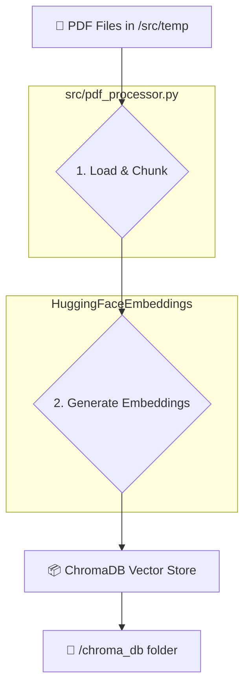

# 🤖 PDF Q&A: ระบบถาม-ตอบข้อมูลจากคลัง PDF ด้วย RAG และ LLM

โปรเจกต์นี้คือระบบถาม-ตอบ (Question-Answering) อัจฉริยะ ที่สามารถตอบคำถามโดยอ้างอิงเนื้อหาจากคลังเอกสาร PDF ส่วนตัวของผู้ใช้ ถูกสร้างขึ้นโดยใช้สถาปัตยกรรม Retrieval Augmented Generation (RAG) เพื่อให้ได้คำตอบที่แม่นยำ, ตรงประเด็น, และลดการสร้างข้อมูลที่ไม่เป็นจริง (Hallucination) จาก Large Language Model (LLM)

ผู้ใช้สามารถเพิ่มไฟล์ PDF ที่ต้องการลงในคลังข้อมูล จากนั้นระบบจะทำการประมวลผลและจัดทำดัชนี (Indexing) เพื่อให้พร้อมสำหรับการค้นหาและตอบคำถามผ่านหน้าเว็บแอปพลิเคชันที่ใช้งานง่าย

### ✨ คุณสมบัติหลัก (Features)

- **Data Indexing:** ประมวลผลไฟล์ PDF, แบ่งเนื้อหาเป็นส่วนย่อย (chunks), และสร้าง Vector Embeddings เพื่อจัดเก็บลงใน Vector Database
- **Retrieval Augmented Generation (RAG):** ค้นหาข้อมูลส่วนที่เกี่ยวข้องที่สุดจากคลังข้อมูลเพื่อนำมาเป็นบริบท (context) ให้ LLM ใช้ในการสร้างคำตอบ
- **Q&A Interface:** หน้าเว็บแอปพลิเคชันสำหรับให้ผู้ใช้พิมพ์คำถามและรับคำตอบ พร้อมแสดงเอกสารอ้างอิง
- **Local First:** ทำงานได้สมบูรณ์บนเครื่อง local โดยใช้ Ollama ในการรัน LLM และ ChromaDB เป็น Vector Store
- **Data Visualization:** สคริปต์สำหรับแสดงภาพความสัมพันธ์ของข้อมูลใน Vector Database ในรูปแบบ 2 มิติ

### 🛠️ เทคโนโลยีที่ใช้ (Tech Stack)

- **Backend & Orchestration:** Python, LangChain
- **LLM:** Ollama (รองรับโมเดลต่างๆ เช่น Llama 3, Mistral)
- **Embedding Model:** Sentence Transformers (จาก Hugging Face)
- **Vector Database:** ChromaDB
- **Web Interface:** Streamlit
- **Dependency Management:** Poetry
- **Workflow Automation:** Poe the Poet

---

## 📂 โครงสร้างไฟล์ในโปรเจกต์ (Project Structure)

```
llm-pdf-rag-summary/
├── .streamlit/
│   └── config.toml        # ไฟล์ตั้งค่าสำหรับ Streamlit (เช่น ปิด file watcher)
├── chroma_db/               # โฟลเดอร์ที่ ChromaDB สร้างขึ้นเพื่อเก็บข้อมูล (auto-generated)
├── src/
│   ├── init.py
│   ├── logger_config.py     # ตั้งค่าการแสดงผล log ให้สวยงามด้วย Rich
│   ├── pdf_processor.py     # โค้ดสำหรับโหลดและประมวลผลไฟล์ PDF
│   ├── qa_system.py         # Logic หลักของระบบ RAG และการตอบคำถาม
│   └── temp/                # โฟลเดอร์สำหรับใส่ไฟล์ PDF ที่ต้องการให้ระบบเรียนรู้
├── .env                     # (Optional) สำหรับเก็บ API keys อื่นๆ ในอนาคต
├── .gitignore
├── app.py                   # สคริปต์หลักสำหรับรัน Streamlit Web App
├── visualize_db.py          # สคริปต์สำหรับสร้างภาพ Visualization ของ Vector DB
├── poetry.lock
└── pyproject.toml           # ไฟล์ตั้งค่าโปรเจกต์, dependencies, และ workflow ของ Poe
```

---

## ⚙️ การตั้งค่าและสิ่งที่จำเป็น (Prerequisites & Setup)

ก่อนรันโปรเจกต์ ตรวจสอบให้แน่ใจว่าคุณได้ตั้งค่าตามขั้นตอนต่อไปนี้แล้ว

| เครื่องมือ / บริการ | คำอธิบายการตั้งค่า | คำสั่ง (ถ้ามี) |
| :--- | :--- | :--- |
| **Poetry** | ติดตั้ง Dependencies ทั้งหมดของโปรเจกต์ | `poetry install` |
| **Ollama** | ติดตั้ง Ollama และดาวน์โหลด LLM ที่ต้องการมาเก็บไว้ในเครื่อง | `ollama pull llama3` |
| **Hugging Face**| ล็อกอินเพื่อยืนยันตัวตนในการดาวน์โหลด Embedding Model | `huggingface-cli login` |

---

## 🚀 วิธีการรันโปรเจกต์ (Getting Started)

โปรเจกต์นี้ใช้ **Poe the Poet** ในการจัดการ Workflow ทำให้สามารถรันขั้นตอนต่างๆ ได้ง่ายผ่านคำสั่งสั้นๆ

1.  **ติดตั้ง Dependencies ทั้งหมด (ทำครั้งแรก):**
    ```bash
    poetry install
    ```

2.  **สร้างดัชนีข้อมูล (Indexing):**
    นำไฟล์ PDF ของคุณไปใส่ในโฟลเดอร์ `src/temp/` จากนั้นรันคำสั่งนี้เพื่อให้ระบบประมวลผลและสร้าง Vector Database:
    ```bash
    poe index
    ```
    *(หากต้องการล้างของเก่าและสร้างใหม่ทั้งหมด ใช้ `poe reindex`)*

3.  **เปิดใช้งาน Web App:**
    หลังจากสร้างดัชนีสำเร็จ ให้รันคำสั่งนี้เพื่อเปิดหน้าเว็บสำหรับถาม-ตอบ:
    ```bash
    poe start
    ```
    จากนั้นเปิดเบราว์เซอร์ไปที่ `http://localhost:8501`

---

## 📈 Diagram อธิบายระบบ RAG (RAG Architecture Diagram)

ระบบนี้แบ่งการทำงานออกเป็น 2 ส่วนหลักคือ **Indexing Pipeline** (การเตรียมข้อมูล) และ **Querying Pipeline** (การตอบคำถาม)

### 1. Indexing Pipeline (รันด้วย `poe index`)



### 2. Querying Pipeline (รันด้วย `poe query`)
```
graph TD
    subgraph "User via Streamlit UI"
        A[❓ User's Question]
    end

    subgraph "RAG System (Backend)"
        B{1. Convert Query to Vector};
        C{2. Similarity Search};
        D[📚 Retrieved Chunks];
        E{3. Augment Prompt};
        F[🧠 Ollama LLM];
        G[💬 Final Answer];
    end

    subgraph "Existing Vector Store"
        VS[📦 ChromaDB]
    end

    A --> B;
    B --> C;
    C -- finds relevant vectors --> VS;
    VS -- returns relevant chunks --> D;
    A --> E;
    D --> E;
    E --> F;
    F --> G;
    
    subgraph "HuggingFaceEmbeddings"
        B
    end

    G --> H[💻 Display on Streamlit UI];
```